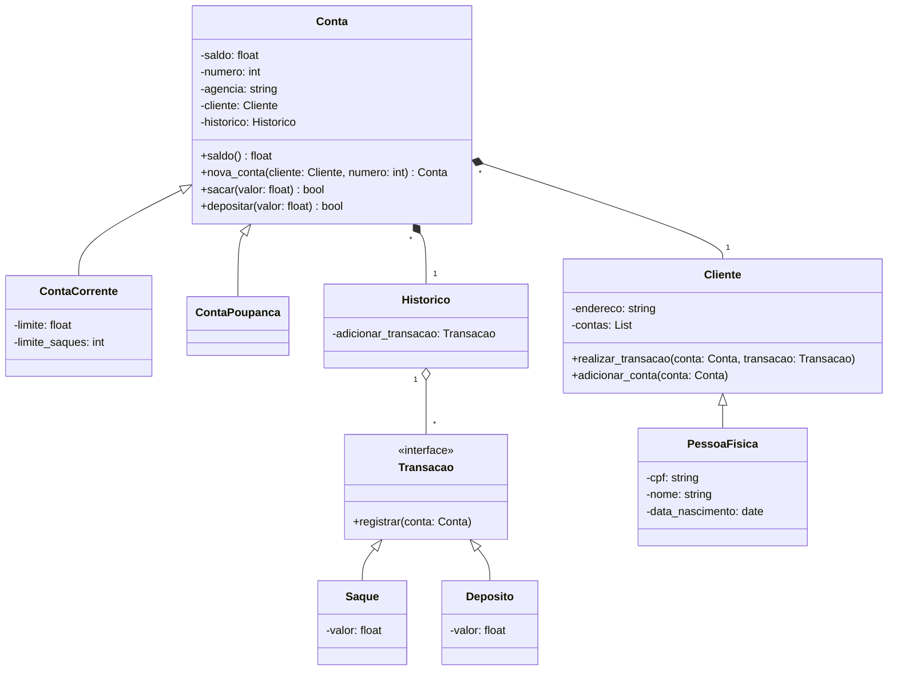

## DIO: Python AI Backend Developer

### 1° Desafio de Código

Sistema bancário em **Python**

### Objetivo
Criar um sistema bancário com as  operações:
- Depositar
- Sacar
- Visualizar Extrato
 
Só é possível realizar três saques diários com um limite de **R$500** por saque.

[código](conta_corrente.py)

### 2° Desafio de Código

Otimizando o Sistema Bancário com Funções Python

### Objetivo
- Melhorar o código criando funções para as operações utilizadas no desafio anterior. 
- Criar novas operações para criação de usuário e contas.

[código](conta_corrente_funcoes.py)

### 3° Desafio de Código

Modelando o Sistema Bancário em POO com Python

### Objetivo
- Armazenar os dados dos cliente e contas bancárias em objeto.
- O código deve seguir o modelo de classes abaixo

[código](conta_corrente_classes.py)